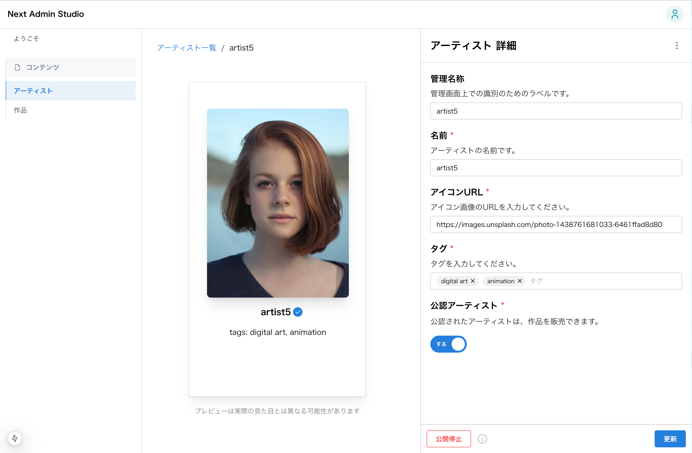

# Next Admin Studio

[scaffdog](https://scaff.dog/) を用いて高速に管理画面を開発するためのテンプレートプロジェクトです。



Next.js, Mantine UI, Zustand を主に利用しています。

## テンプレートを利用して生成できるもの

1. 一覧画面

コンテンツの一覧画面です。
URLSearchParams と連動した検索フォーム、ページネーションがついています。


1. 詳細画面

コンテンツの詳細（編集）画面です。
編集のためのフォーム、フォームと連動したプレビューがついています。プロパティに合わせてインプットをカスタマイズして生成できます。


3. 新規作成画面

コンテンツの新規作成画面です。内容は詳細画面とほぼ同じですが、詳細画面とは別に `/[model]/new` のパスでページを用意しています。


## 管理画面の開発手順

scaffdog を利用して管理画面を開発する際の手順について説明します。

この手順はあくまでデフォルトの設定で標準的なコンテンツの管理画面を生成する場合の手順です。プロジェクトの要件に合わせてテンプレートをカスタマイズしたり、手動でコードを追加したりしてください。

Artist というコンテンツを管理する場合を例に説明します。

### 1. 立ち上げ

まず、`scaffold` コマンドを用いて Artist の一覧・新規作成・詳細画面の大部分を作成します。`scaffold` コマンドは複数の scaffdog テンプレートを一括で実行するシェルスクリプトを実行します。

```bash
# $1: モデル名
# $2: パス名
# $3: 呼称
pnpm scaffold artist artists アーティスト
```

### 2. 詳細フォームインプットの追加

Artist　のプロパティに合わせて form-input テンプレートを利用することで、詳細画面が大方完成します(※)。

例えば、Artist に下記のプロパティの入力が必要な場合、

```typescript
export type Artist = {
  name: string;
  iconUrl: string;
  tags: string[];
  authorized: boolean;
};
```

下記のコマンドを実行することで、詳細画面のフォームに各種インプットが追加されます。コマンドは `nr gen` で対話式に実行することもできます。


```bash
# name
pnpm exec scaffdog generate form-input-text -f --answer "property:name" --answer "required:true" --output "/model/artist/components/form-with-preview"

# iconUrl
pnpm exec scaffdog generate form-input-text -f --answer "property:iconUrl" --answer "required:true" --output "/model/artist/components/form-with-preview"

# tags
pnpm exec scaffdog generate form-input-tags -f --answer "property:tags" --answer "required:true" --output "/model/artist/components/form-with-preview"

# authorized
pnpm exec scaffdog generate form-input-switch -f --answer "property:authorized" --answer "required:true" --output "/model/artist/components/form-with-preview"
```

あとは各種インプットのラベルやディスクリプション、バリデーションなどを編集してください。

(※) デフォルトでは [Injection](https://scaff.dog/docs/templates/injection) 箇所に一部手作業が発生します。

### 3. 一覧の検索フォームインプットの追加

一覧の検索フォームについても、search-inputテンプレートを用いて追加することができます。

```bash
# タグ検索を追加
pnpm exec scaffdog generate search-input-checkbox -f --answer "property:tags" --output "/model/artists/components/list/search"
```

詳細フォームと同様にラベルやディスクリプションを編集してください。

その他デフォルトで利用できるテンプレートについては [`.scaffdog/`](.scaffdog/) を参照してください。

## ディレクトリ構成

`src/` 配下に `app/`, `common/`, `model/` を配置しており、例えば Artist の管理画面を開発する場合には各種モジュールが `model/artist/` に配置されます。詳細は [`model/artist/`](src/model/artist) を御覧ください。

