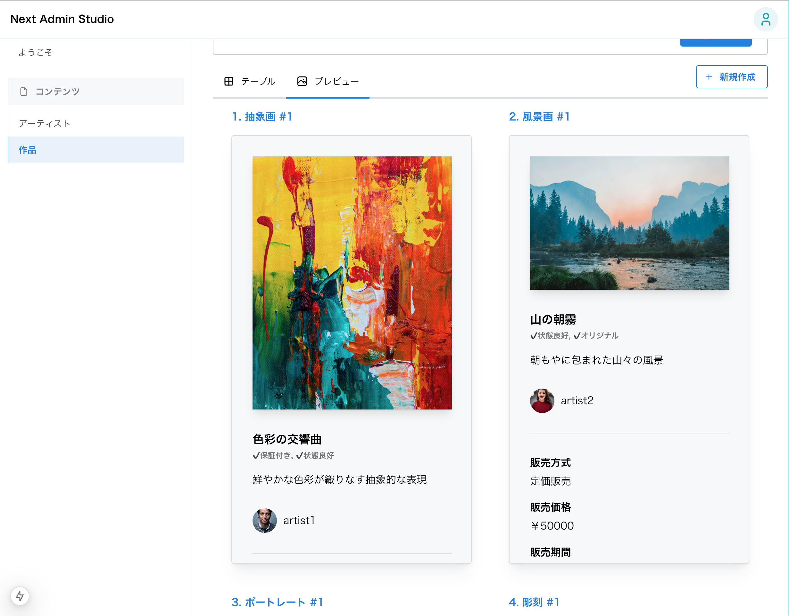

# これはなに

この管理画面で表示するコンテンツプレビューには2種類あります。

- フォームの編集中に表示するプレビュー
- リストでプレビュー一覧として表示するプレビュー

この2種類は見た目こそ同じですが、非機能要件的、あるいは技術的な制約により完全に同一なコンポーネントでは実装されていません。

その背景と、実際の設計について説明します。

# フォームとリストのプレビューの違い

フォームのプレビューは各プロパティのinputに対してreactiveであり、いわば「ボトムアップ型」で構成されています。一方でリストのプレビューはサーバーから取得してきたデータに対してread onlyであるり、いわば「トップダウン型」で構成されています。

フォームのプレビューは各inputのzustandのストアの値を用いて構成されているため、素直に実装すれば例えばtitleの変更に応じてプレビュー全体が再レンダリングされてしまいます。これは非常に非効率で、場合によっては操作をカクつかせてしまいます。従って、例えばtitleを入力したときの再レンダリング範囲はTitlePreviewコンポーネントに限定する必要があります。


一方でリストのプレビューは、Model[]型のデータを丸ごと受け取って見た目を描画したいです。サーバーから取得してきたデータをmapしてそのまま `<ArtistListPreviewItem artist={artist} />` と流し込みたいです。



# 見た目の共通化設計

以上の通り両者の設計は根本的に異なるわけですが、見た目としては同じプレビューなので、プレビューの一貫性を保つためにも表層レイヤーは共通化したいです。

そこで、下記のような設計を取ります。

まず大枠として、フォームのプレビューの素材をリストのプレビューで再利用します。

フォームのプレビューを、Container/Presenterパターンで設計します。Containerはもちろんストアの値を参照します。

```tsx
export const ArtistNamePreviewView: FC<{ value: string }> = ({
  value,
}) => (
  <Text fw="bold" size="lg" mb="md">
    {value}
  </Text>
);

export const ArtistNamePreviewContainer = () => {
  const name = useArtistFormStore((state) => state.name);
  return <ArtistNamePreviewView value={name} />;
};
```

フォームのプレビュー全体は、このContainerを組み立てて構成されます。

```tsx
export const ArtistFormPreview = () => {
  return (
    <ArtistPreviewTemplate
      authorized={<ArtistAuthorizedPreviewContainer />}
      iconUrl={<ArtistIconUrlPreviewContainer />}
      name={<ArtistNamePreviewContainer />}
      tags={<ArtistTagsPreviewContainer />}
    />
  );
};

```

リストのプレビューは、Presenterを組み立てて構成されます。

```tsx
<ArtistPreviewTemplate
  iconUrl={<ArtistIconUrlPreviewView value={artist.iconUrl} />}
  name={<ArtistNamePreviewView value={artist.name} />}
  authorized={
  <ArtistAuthorizedPreviewView value={artist.authorized} />
  }
  tags={<ArtistTagsPreviewView value={artist.tags} />}
/>
```
