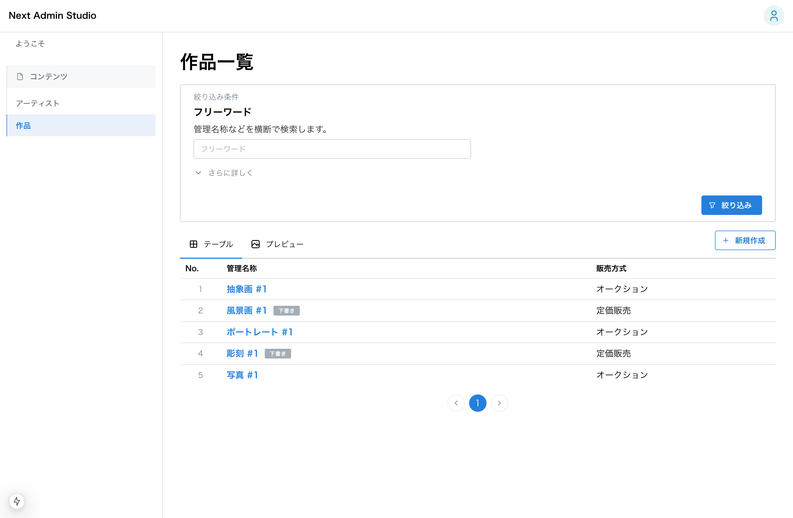
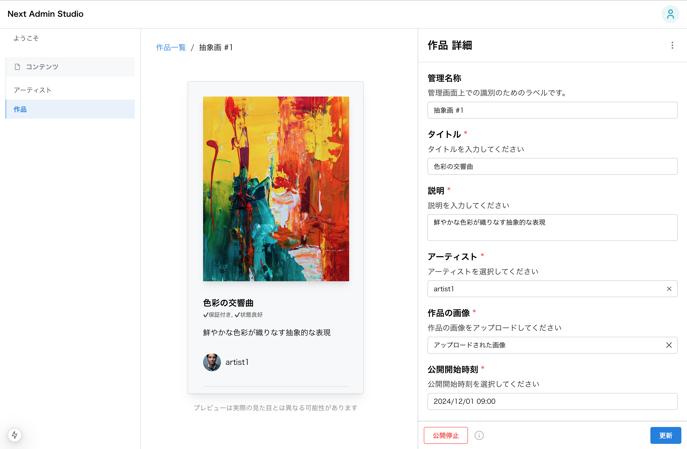

# 作品

## 一覧画面

## 詳細画面

## 管理項目

| 項目 | 説明 | 入力の種類 |
| ---- | ---- | ---- |
| 管理名称 | 管理上の名称（一覧画面で表示される） | テキスト入力 |
| アーティスト | 作品の作者 | 選択肢入力 |
| 評価項目 | 作品の評価項目 | チェックボックス |
| 説明 | 作品の説明 | テキストエリア入力 |
| 画像 | 作品の画像 | ファイル入力 |
| 公開開始時刻 | 作品の公開開始時刻 | 日付時間入力 |
| 販売期間 | 作品の販売期間 | 日付時間範囲入力 |
| 販売方式 | 作品の販売方式 | ラジオボックスと数値入力の組み合わせ |
| タイトル | 作品のタイトル | テキスト入力 |

